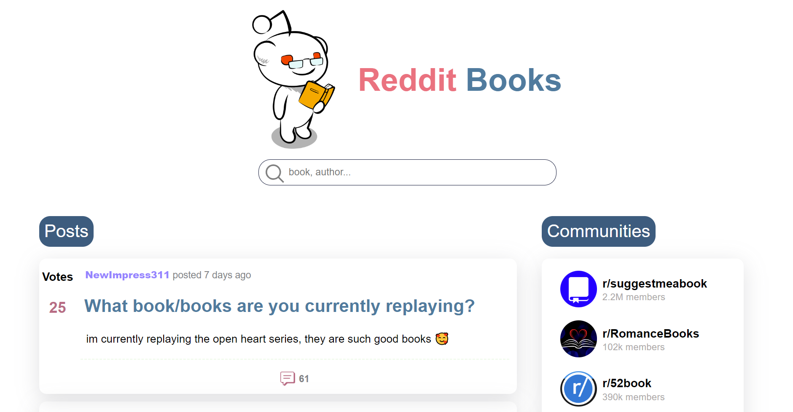

# Reddit Books app

## About

Front-End React/Redux Application that connects to the Reddit API (json) to provide the 'best' posts about books.

## Table of Contents

* [Project Description](#project-description)
* [Screenshots](#screenshots)
* [Technologies](#technologies)
* [Setup](#setup)
* [Code Examples](#code-examples)
* [Project Requirements](#project-requirements)
* [Future work](#future-work)

## Project Description

A simple Reddit client for browsing posts and selected subreddit categories about books. This project was created as an assignment of Codecademy's Full Stack Engineer Path.

## Screenshots

### Desktop


### Mobile


## Technologies

* HTML & CSS
* JavaScript
* React
* Redux (React & Toolkit)
* React Testing Library
* Jest

## Setup

Please use npm install & npm start to run the application in your local environmnet.

## Code Examples

Example of a Slice with API call:

```javascript
import { createAsyncThunk, createSlice } from '@reduxjs/toolkit';

export const loadPosts = createAsyncThunk(
  'allPosts/getPosts',
  async (searchTerm) => {
    let url = urlToFetch(searchTerm);
    const res = await fetch(url);
    const data = await res.json();
    return data.data.children;
  },
);

export const loadCommunityPosts = createAsyncThunk(
  'allCommunityPosts/getCommunityPosts',
  async (url) => {
    const res = await fetch(url);
    const data = await res.json();
    return data.data.children;
  },
);

const sliceOptions = {
  name: 'allPosts',
  initialState: {
    posts: [],
    isLoading: false,
    hasError: false,
  },
  reducers: {},
  extraReducers: {
    [loadPosts.pending]: (state) => {
      state.isLoading = true;
      state.hasError = false;
    },
    [loadPosts.fulfilled]: (state, action) => {
      state.posts = action.payload;
      state.isLoading = false;
      state.hasError = false;
    },
    [loadPosts.rejected]: (state) => {
      state.isLoading = false;
      state.hasError = true;
    },
    [loadCommunityPosts.pending]: (state) => {
      state.isLoading = true;
      state.hasError = false;
    },
    [loadCommunityPosts.fulfilled]: (state, action) => {
      state.posts = action.payload;
      state.isLoading = false;
      state.hasError = false;
    },
    [loadCommunityPosts.rejected]: (state) => {
      state.isLoading = false;
      state.hasError = true;
    },
  },
};

export const allPostsSlice = createSlice(sliceOptions);
export const selectPosts = (state) => state.allPosts.posts;
export default allPostsSlice.reducer;
```

Example of a Component:

```javascript
const HomeDesktop = () => {
  const dispatch = useDispatch();
  const searchTerm = useSelector(selectSearchTerm);
  const { hasError, isLoading } = useSelector((state) => state.allPosts);

  useEffect(() => {
    dispatch(loadPosts(searchTerm));
  }, [dispatch, searchTerm]);

  const data = useSelector(selectPosts);

  const tryAgainHandler = () => {
    dispatch(loadPosts(searchTerm));
  };

  return (
    <main id="posts-wrapper">
      {hasError ? (
        <div id="error-wrapper">
          <h1 className="error-message">
            {' '}
            Reddit is having lunch. Please try again! :)
          </h1>
          <button className="try-again-button" onClick={tryAgainHandler}>
            Try again
          </button>
        </div>
      ) : (
        <>
          <div className="main-content-container">
            <section className="preview-posts-section">
              <h2 className="header">Posts</h2>
              {isLoading ? (
                <div className="spinner">
                  <Spinner />
                </div>
              ) : (
                data.map((post) => (
                  <PreviewPost postPreview={post} key={post.data.id} />
                ))
              )}
            </section>
            <section className="preview-communities-section">
              <h2 className="header">Communities</h2>
              <div className="communities-container">
                {communities.map((community) => (
                  <Community community={community} key={community.id} />
                ))}
              </div>
            </section>
          </div>
          <GoTopButton />
        </>
      )}
    </main>
  );
};

export default HomeDesktop;
```

## Project Requirements

- [x] Build the application using React and Redux
- [x] Version control your application with Git and host the repository on GitHub
- [x] Write unit tests for your components using Jest
- [x] Users can use the application on any device (desktop to mobile)
- [x] Users can use the application on any modern browser
- [x] Users see an initial view of the data when first visiting the app
- [x] Users can search the data using terms
- [x] Users can filter the data based on categories that are predefined
- [x] Users are delighted with a cohesive design system
- [x] Users are able to leave an error state
- [x] Users are shown a detail view (modal or new page/route) when they select an item
- [x] Get 90+ scores on Lighthouse (97)
- [x] Set up a CI/CD workflow to automatically deploy your application when the main branch in the repository changes

## Future work:
- [ ] Save posts
- [ ] Filter by 'Hot', 'Best', 'New', 'Top', 'Rising'
- [ ] Write end-to-end tests
- [ ] Make the application a progressive web app
